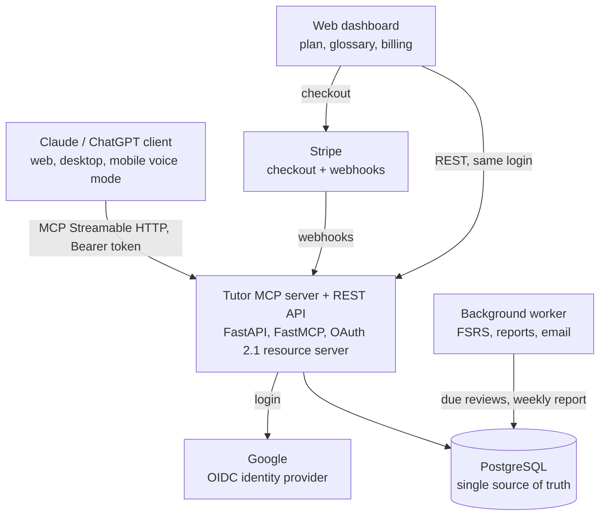

# English Tutor MCP — Product & Technical Requirements

As of 2026-10-03 · Author: Jorge

## 1. Purpose and scope

Build a remote MCP server that turns Claude (and later ChatGPT) into a persistent, voice-first English tutor for Spanish-speaking professionals, with the user's own LLM subscription paying for inference. The server owns everything the chat cannot keep on its own: diagnostic level, an adaptive plan, session history, a glossary with spaced repetition, and per-session metrics. The chat client owns the teaching conversation itself.

**One-line value proposition:** a tutor that never forgets you — every session starts exactly where the last one ended, your errors are tracked across weeks, and your progress lives on your server, not inside one AI vendor.

**Headline use-case:** "prepare me for tomorrow's standup / interview / demo / client call." The plan is the long-term spine; the prep session is the reason to open the app today. `start_lesson` accepts a free-text `prep` event and builds the scenario around it, logging the session against the closest plan item.

**In scope for v1**

- Remote MCP server (Streamable HTTP) with OAuth 2.1 login via Google.
- Diagnostic test, plan generation and weekly re-planning.
- Lesson skill: warm-up, task-based scenario, structured feedback, close.
- Glossary capture with user confirmation and FSRS-scheduled reviews.
- Session metrics computed server-side from raw evidence, plus a weekly email report.
- Minimal web dashboard: login, plan, progress, glossary, billing.
- Annual or credit-based billing (Stripe; Conekta or Mercado Pago evaluated for Mexico).

**Out of scope for v1** (see section 2): own voice/audio pipeline, pronunciation scoring, mobile apps, ChatGPT-specific client work beyond keeping the MCP spec-compliant, gamification, social features.

**Primary success metric:** 30-day retention of paying users (target ≥ 40%) and sessions per active user per week (target ≥ 4). Secondary: measured drop in recurring errors and chunk activation rate (section 11).

**Timeline assumption:** a one-week spike, then a 4-week core loop (v0), then a validation gate of 15 real sessions before anything else is built (section 16). Plan engine, dashboard, billing and reports start only after the gate passes; no calendar date is promised for v1.

## 2. Product principles and non-goals

These principles resolve design disputes; when two requirements conflict, the higher-numbered principle yields.

1. **Output over input.** Every session must make the user speak or write. If the user produced fewer than 40% of the words in a session, the session design failed, not the user.
2. **The server is the memory; the LLM is the teacher.** Nothing pedagogically important lives only in the chat transcript. The LLM never counts, schedules or grades on its own; it reports evidence and the server computes.
3. **Minimal meta-text.** Explanations, headings and lists are capped (section 12). Natural English in conversation is never shortened or simplified below the user's level.
4. **Honest expectations.** The product sells "speak with confidence at work in 90 days", never "B2 in 90 days". CEFR estimates are shown as trends, not as a certified level.
5. **Zero setup for the user.** Google login, connect the MCP, say "start my lesson". No prompt engineering, no file uploads, no external apps (no Anki, no Notion).
6. **Confirm before persisting.** Glossary items and session summaries are saved only after the user confirms (one-tap / one-phrase). Unconfirmed data is stored as provisional and asked about at the next session start.
7. **Vendor-portable.** The user's data and plan work identically whether the client is Claude or ChatGPT; nothing depends on vendor-specific memory. Portability is tested, not assumed: the spike includes a pedagogical consistency test across clients (section 15).

**Explicit non-goals for v1**

- No audio processing: no pronunciation, intonation or pause metrics. The product states this openly.
- No own LLM inference costs in the core loop; the server never calls an LLM API during a lesson. (A small, optional LLM call for the weekly report is allowed if it stays under USD 0.01 per user per week.)
- No gamification beyond streak count; no leaderboards, badges or social features.
- No content library of pre-written lessons; scenarios are generated per session from the plan.
- No micro-lesson format in the Duolingo sense (tap-to-answer drills).

## 3. Target users, supported clients and plans

**Primary persona (v1):** Spanish-speaking software professionals in Latin America, CEFR B1–B2, who already understand English well but freeze when speaking in standups, code reviews, interviews and client calls. They already use Claude or ChatGPT daily.

**Secondary persona (v2):** same profile in other professions (sales, product, design), selected at onboarding as a "domain".

**Supported clients at launch**

| Client | Connection path | Status | Notes |
| --- | --- | --- | --- |
| Claude web / desktop / mobile | Custom connector (remote MCP, OAuth) | Must work | Available on Free, Pro, Max, Team, Enterprise; Free users get one custom connector |
| Claude voice mode (mobile) | Same connector, voice session | Must verify in spike | Open question: whether tool calls run inside a voice session |
| Claude Code | `claude mcp add --transport http` | Should work | Power users; MCP prompts exposed as slash commands |
| ChatGPT | Connector / developer mode | Nice to have | Spec-compliant server; verify plan availability before marketing it |

**Plans**

| Plan | Price | Limits | Purpose |
| --- | --- | --- | --- |
| Free | USD 0 | 1 active plan, 3 sessions/week, 50 glossary items, no weekly report | Try the loop; convert on habit, not on paywall |
| Annual | USD 19–39/year (cohort test, section 13) | Unlimited sessions, unlimited glossary, weekly report, 3 domains | Core offer; annual avoids per-transaction fee erosion at USD 1–2/month |
| Credits (optional, v1.1) | Pack of N sessions | Pay-as-you-go | Users who refuse subscriptions |

Monthly billing at USD 1–2 is rejected: Stripe fees (~USD 0.30 + 2.9%) consume 25–35% of each charge.

## 4. Architecture and tech stack

One Python service exposes both the MCP endpoint and a small REST API over the same Postgres database; the LLM is never called from the server during a lesson.



The client talks only to the MCP endpoint; the dashboard talks only to the REST API; both share one OAuth session and one database. The worker runs scheduled jobs (FSRS due-date recalculation, weekly reports, provisional-data cleanup) and is the only component that sends email.

**Stack decisions**

| Layer | Choice | Reason |
| --- | --- | --- |
| Language / framework | Python 3.12, FastAPI | Author's main stack; async; OpenAPI for the dashboard |
| MCP | Official Python SDK / FastMCP, Streamable HTTP transport | Spec-compliant OAuth support; stdio not needed |
| Database | PostgreSQL 16 (+ `pgcrypto`) | Relational data, JSONB for raw session evidence |
| Migrations | Alembic | Standard |
| Auth | Authlib (OIDC with Google) + own OAuth 2.1 authorization server with PKCE and dynamic client registration | Required by MCP spec for remote servers; Claude registers as a client dynamically |
| Scheduler | APScheduler in a separate worker process (Celery/Redis only if load requires) | Keep infra to one DB + one app for v1 |
| Email | Resend (or SES) | Weekly report, reminders |
| Dashboard | Server-rendered (Jinja2 + HTMX) | No SPA build; fastest for one developer |
| Payments | Stripe Checkout + Billing webhooks; evaluate Conekta / Mercado Pago for MXN | Annual plan only in v1 |
| Hosting | Single VPS or the author's homelab behind Cloudflare Tunnel; Docker Compose | USD ≤ 10/month target |
| Observability | Structured JSON logs, Sentry, Prometheus metrics endpoint | Tool-call latency and error rate per tool |

**Deliberately not in the stack:** LLM API calls in the lesson loop, vector databases, Anki/AnkiConnect, Notion, message queues (v1).

## 5. Authentication, authorization and security

The server is an OAuth 2.1 resource server and its own authorization server; Google is the only identity provider in v1. Every MCP request carries a Bearer access token scoped to one user; there are no shared or anonymous tools.

**Login flow (MCP client)**

1. Client requests `/.well-known/oauth-protected-resource` and `/.well-known/oauth-authorization-server` (RFC 9728 / RFC 8414).
2. Client registers dynamically (RFC 7591) or uses a pre-registered client id; PKCE (S256) is mandatory.
3. Authorization endpoint redirects to Google OIDC; on return the server creates or links the user by Google `sub`, never by email alone.
4. Server issues a short-lived access token (JWT, 60 min) and a rotating refresh token (30 days, single use). Tokens are bound to the MCP resource URL (`resource` parameter / audience claim).
5. Dashboard uses a separate session cookie (HttpOnly, Secure, SameSite=Lax) from the same Google login.

**Authorization rules**

- Every table with user data has `user_id`; every query is filtered by the token's subject. Row-level security in Postgres is enabled as a second layer.
- Plan limits (section 3) are enforced server-side per tool call, never by the client.
- Admin role exists only for the author; no admin tools are exposed over MCP.

**Security requirements**

- TLS only; HSTS; CORS restricted to the dashboard origin.
- Rate limits per user and per IP on every endpoint (default 60 tool calls/minute, 10 session starts/day).
- Input validation with Pydantic on every tool; payload size cap 64 KB per call; raw session evidence capped at 20 KB.
- Prompt-injection stance: tool results carry formatting instructions for the LLM (section 12) but never echo user-supplied text as instructions. User text is stored and returned as data fields only.
- Secrets in environment variables; Google and Stripe secrets never logged. Stripe webhooks verified by signature.
- Audit log of login, token issuance, plan changes and data deletion.
- Dependency scanning in CI; monthly review of OAuth library CVEs.

**Privacy**

- Store only what the tools receive: user turns as reported by the LLM, errors, glossary. No audio, no full transcripts.
- Data export (JSON) and full account deletion from the dashboard, completed within 24 h; required for Mexican LFPDPPP and useful for GDPR-style users.
- Privacy notice explains that lesson content passes through the user's LLM vendor under that vendor's terms.

## 6. Data model

Eleven tables carry v1; raw evidence lives in JSONB so metrics can be recomputed when the formulas change.

| Table | Key fields | Notes |
| --- | --- | --- |
| `users` | id, google_sub, email, display_name, native_lang, created_at, deleted_at | Soft delete, then purge job |
| `profiles` | user_id, domains[] (it, daily, business…), goal_text, minutes_per_day, days_per_week, current_level_speaking, current_level_writing, target_level, target_date | Levels stored as CEFR + numeric 1.0–6.0 |
| `subscriptions` | user_id, plan (free/annual/credits), status, stripe_customer_id, stripe_sub_id, period_end, credits_left | Source of plan limits |
| `plans` | id, user_id, version, status (active/superseded), generated_at, rationale | One active plan per user |
| `plan_items` | plan_id, week_no, order_no, cefr_descriptor (can-do id), skill (speaking/writing/listening), domain, scenario_hint, status (pending/done/skipped), done_session_id | The unit the lesson skill consumes |
| `cefr_descriptors` | id, level, skill, text_en, text_es | Static seed: CEFR can-do statements B1–C1 |
| `sessions` | id, user_id, plan_item_id, started_at, ended_at, status (open/closed/incomplete), mode (voice/text), client (claude/chatgpt/code), task_result, hints_given, cefr_estimate_speaking, confidence_1_5, raw_evidence JSONB | `raw_evidence` = the full `end_session` payload |
| `session_metrics` | session_id, user_words, assistant_words, user_ratio, turns, unique_lemmas, words_per_turn, l1_switches, errors_total, errors_by_category JSONB, recurring_errors, chunks_offered, chunks_used, uptake_count | Computed by the server from `raw_evidence` |
| `glossary_items` | id, user_id, kind (correction/chunk/term), text, meaning, context_sentence, domain, origin_session_id, status (provisional/confirmed/archived), seen_count, last_seen_session_id | Unique on (user_id, normalized text) |
| `review_states` | glossary_item_id, stability, difficulty, due_at, last_review_at, reps, lapses, leech (bool) | FSRS-4.5 state per item |
| `review_logs` | id, glossary_item_id, session_id, rating (1–4), reviewed_at, elapsed_days | Append-only; feeds FSRS optimizer later |
| `weekly_reports` | user_id, week_start, payload JSONB, sent_at | Cached report, one row per week |
| `audit_log` | user_id, event, meta JSONB, at | Security events (section 5) |

**Integrity rules**

- One `open` session per user; `start_lesson` closes any previous open session as `incomplete` before creating a new one.
- `glossary_items` are normalized (lowercase, trimmed, punctuation stripped) before the uniqueness check; a repeat increments `seen_count` and pulls `due_at` forward instead of inserting.
- Recurring error = same normalized `correct` form reported in ≥ 2 distinct sessions within 30 days.
- Deleting a user cascades through every table and removes the Stripe customer link; the `audit_log` keeps a hashed user id only.

## 7. MCP surface: tools, prompts, instructions

Nine tools, three prompts and one `instructions` string make up the whole MCP contract. Every tool returns structured JSON plus a short `response_rules` field that tells the LLM how to speak next.

**Server `instructions`** (sent once at `initialize`; ≤ 400 words)

- Role: English tutor for Spanish speakers; speak English unless the user asks otherwise; in voice sessions answer in 1–3 sentences.
- Never explain grammar unless asked or unless an error recurs; correct after the user finishes a thought, never mid-sentence.
- Always call `start_lesson` at the beginning of a session and `end_session` at the end; never invent counts, levels or vocabulary not present in the conversation.
- No markdown, lists or headings while in conversation mode; structured output only when a tool's `response_rules` asks for a summary.

**Tools**

| Tool | Input (required) | Output | Idempotency / limits |
| --- | --- | --- | --- |
| `get_profile` | — | profile, plan summary, streak, open-session flag, provisional items count | Read |
| `run_diagnostic` | `answers[]` (text + task id), `mode` | level estimate per skill, 3 strengths, 3 gaps, triggers plan generation | Once per 28 days unless user forces |
| `get_plan` | `week_no?` | plan items for the week, status per item | Read |
| `update_plan` | `action` (add_topic/skip/reorder/regenerate), `payload` | new plan version | Writes a new `plans.version` |
| `start_lesson` | `mode` (voice/text), `domain?`, `minutes?`, `prep?` (free-text event, e.g. "standup tomorrow about the outage") | `session_id`, today's plan item (can-do), 5 chunks with examples, scenario brief, due reviews (≤ 8), provisional items to confirm, `response_rules` | Closes any open session as `incomplete`; enforces plan limits |
| `get_due_reviews` | `domain?`, `limit?` (≤ 12) | items with context sentence and prompt type (produce / recall / correct) | Read |
| `record_review` | `results[]` of `{item_id, rating 1–4}` | updated due dates | Idempotent per (session, item) |
| `save_glossary` | `session_id`, `status` (confirmed/provisional), `items[]` of `{kind, text, meaning, context_sentence, domain}` | `{new, reinforced, rejected[]}` | Dedup by normalized text; max 10 per call |
| `end_session` | `session_id`, `user_turns[]`, `errors[]`, `chunks_used[]`, `task_result`, `hints_given`, `cefr_estimate` (with confidence and evidence), `confidence_1_5`, `assistant_words_estimate?` | computed metrics, 4-line summary text, streak | Idempotent per `session_id`; validates `errors[].said` against `user_turns` |

**`end_session` schema (abridged)**

```json
{
  "session_id": "uuid",
  "user_turns": ["string"],
  "errors": [{"said": "string", "correct": "string", "category": "grammar|lexis|word_order|register|other"}],
  "chunks_used": ["chunk_id"],
  "task_result": "achieved|partial|not_achieved",
  "hints_given": 0,
  "cefr_estimate": {"speaking": "B1|B1+|B2|B2+|C1", "confidence": "low|medium|high", "evidence": ["string"]},
  "confidence_1_5": 3,
  "assistant_words_estimate": 0
}
```

`end_session` has no glossary field and cannot write to the glossary (section 10). All enums are closed; unknown fields are rejected; `user_turns` must contain ≥ 1 entry or the session closes as `incomplete`. Any `errors[].said` whose normalized text does not appear as a substring of any `user_turns` entry is discarded and counted in `rejected`.

**Prompts** (visible as slash commands in Claude Code and Desktop)

- `/start-lesson` → calls `start_lesson`, then runs the session flow (section 8).
- `/review` → calls `get_due_reviews` and runs a 5-minute production drill.
- `/weekly` → reads the cached weekly report and reads it aloud in 30 seconds.

**Resources**

- `tutor://plan/current` and `tutor://glossary/recent` as read-only resources for clients that support them; not required for the core loop.

**Compatibility**

- Transport: Streamable HTTP only; SSE fallback not provided.
- Tool descriptions ≤ 120 words each; schemas use `title`/`description` on every field because they double as instructions to the model.
- Tool names are stable; breaking changes ship as new tool names, never as changed schemas.

## 8. Session flow (the lesson skill)

A session is 15–20 minutes, four phases, and the user talks for at least 40% of it. The server dictates the phase content through `start_lesson`; the LLM runs it.

1. **Open (≤ 1 min).** LLM calls `start_lesson`. If provisional items exist from an unclosed session, it asks one yes/no question ("save the 4 items from Tuesday?") and calls `save_glossary`. Then it states today's goal in one sentence ("Today: disagreeing politely in a code review").
2. **Warm-up (2–3 min).** The 5 chunks of the day, each said once by the LLM and repeated once by the user (shadowing). If `due_reviews` is non-empty, up to 4 items are drilled by *production*: the LLM gives the situation in Spanish or a paraphrase and the user must produce the English chunk. Results go to `record_review`.
3. **Scenario (10–12 min).** The LLM plays a role from `scenario_brief` (e.g. a product manager pushing for an early release) and the user must reach a concrete objective. Rules: the LLM stays in character, keeps turns short, gives at most 3 hints, and does not correct until the objective is reached or 12 minutes pass. The user may say "pause" to ask a language question; the LLM answers in ≤ 2 sentences and resumes.
4. **Feedback (2–3 min).** Out of character: the 2–3 most useful corrections (recurring errors first), the chunks the user actually used, and one thing done well. Then the glossary proposal: ≤ 8 items read as a numbered list; the user says "save all" or "drop 2 and 5".
5. **Close (≤ 30 s).** LLM calls `end_session` with the full evidence payload; the server returns the computed summary (4 lines: minutes spoken, errors fixed, chunks activated, streak) which the LLM reads once.

**Scenario design constraints** (enforced in `scenario_brief`)

- Every scenario has an *objective* the user must achieve, an *obstacle* the LLM character introduces, and a *domain*.
- Scenarios rotate across 6 interaction types: explain, negotiate, disagree, ask for help, give feedback, small talk. The same type does not repeat on consecutive days.
- The scenario targets the plan item's can-do descriptor; the chunks of the day are the language the scenario needs.
- Difficulty adapts: if the last 3 sessions were `achieved` with ≤ 1 hint, the next scenario adds a complication; if 2 of the last 3 were `not_achieved`, it simplifies.

**Voice-mode variant**

- Same phases; all LLM turns ≤ 40 words except the feedback phase.
- The glossary proposal is read as "item one… item two…" and confirmation is verbal.
- If the spike (section 15) shows tools do not fire inside voice sessions, the flow becomes: phases 1–2 in text, user switches to voice for phase 3, back to text for phases 4–5. This is a documented fallback, not the target.

**Text-mode variant**

- Same flow; the scenario may include a writing task (a Slack message, a PR comment, a short email) instead of a spoken exchange, selected by the plan item's skill.

## 9. Diagnostic test and adaptive plan engine

The plan is generated from a measured diagnostic, re-planned weekly from session data, and never from a single prompt.

**Diagnostic (10–12 min, once at onboarding, repeatable every 28 days)**

| Task | Skill | What it measures | Scoring |
| --- | --- | --- | --- |
| Describe your current project in 90 seconds | Speaking | Fluency, lexical range, control of past/present | LLM rates on 4 CEFR anchors supplied by the server; server stores words and unique lemmas |
| Respond to a tricky Slack message from a colleague | Writing | Register, accuracy, cohesion | Same |
| Disagree with a decision in a 2-minute role-play | Speaking | Pragmatics, hedging, turn-taking | Same |
| 8 cloze items with professional chunks | Lexis | Passive knowledge of B2/C1 chunks | Deterministic, server-scored |
| Self-assessment: 12 can-do statements (yes/partly/no) | All | Calibration gap vs measured | Deterministic |

Output: `current_level_speaking`, `current_level_writing` (CEFR + numeric), 3 priority gaps as can-do ids, and the calibration gap (self-rating minus measured), which the plan uses to set expectations in week 1.

**Grader reliability (tested in the spike, re-tested on every model change)**

- 20 fixed answer sets are graded 5 times each on Claude (Free and Pro default models) and on ChatGPT. Pass: ≥ 80% of grades within half a CEFR step of the median for that answer set.
- Every LLM grade carries `confidence` (low/medium/high) and `evidence` (the phrases that justified it); the server stores both.
- If the pass criterion fails, the deterministic parts (cloze score, lexical statistics, words per minute) get more weight and the LLM grade is used only as a trend input, never as the planner's level.

**Plan generation (server-side, deterministic)**

- Input: measured levels with their confidence (the planner uses the lower bound of a low-confidence estimate), target level, target date, minutes per day, days per week, selected domains.
- Compute available hours to target; compare with the guided-hours reference (B1→B2 ≈ 180 h, B2→C1 ≈ 200 h). If the target is unreachable at the user's pace, the plan says so and proposes a realistic intermediate milestone ("B1+ with confident work conversations by week 12"). Never silently accept an impossible target.
- Select can-do descriptors for the next 4 weeks from the gap list, weighted 60% speaking, 25% writing, 15% listening, interleaved by interaction type (section 8).
- Attach domain and a scenario hint to each item; 1 item per planned session day.

**Weekly re-planning (worker job, Sunday night)**

- Items `done` with `achieved` advance; items `not_achieved` are re-queued with a simpler variant; items `skipped` twice are dropped and reported.
- If the recurring-error list contains a grammar pattern ≥ 3 times, a focused item is inserted ("past simple vs present perfect in status updates").
- If adherence < 50% of planned days for 2 weeks, the plan reduces to 3 days/week and the weekly email says why. Shrinking a plan to match reality beats an abandoned ambitious plan.
- Every re-plan creates a new `plans.version`; the user can see the diff on the dashboard.

**`update_plan` from chat**

- The user can add a topic ("interview prep next week"), skip, reorder, or regenerate. The LLM calls the tool; the server validates against limits and returns the new week. The LLM never rewrites the plan in its own words.

## 10. Glossary capture and spaced repetition

The glossary stores corrections, chunks and terms with the sentence they came from; FSRS schedules them; reviews are production tasks inside the next sessions, never a separate flashcard app.

**Capture rules**

- Three kinds, in priority order: `correction` (what the user said → what to say), `chunk` (multi-word expression), `term` (single professional word). Single common words are not captured unless the user asks.
- Each item carries `context_sentence`: the user's own sentence, corrected, or the LLM's sentence where the chunk appeared. No item without context.
- `domain` is required (`it`, `daily`, `business`); the user's active domains come from the profile.
- States: *proposed* (in chat only, nothing persisted) → the user approves with one phrase → `save_glossary(status=confirmed)` → *confirmed* (persisted and scheduled). If the session ends without approval, the LLM calls `save_glossary(status=provisional)`: persisted with a 7-day TTL, never scheduled for review, surfaced for a yes/no at the next `start_lesson`. `end_session` cannot write to the glossary. Untouched items stay `provisional` for 7 days, then deleted.
- Dedup: normalized text match → `seen_count += 1`, `due_at` moved to tomorrow, kind upgraded to `correction` if it arrived as a correction. A third reappearance within 30 days flags `leech = true`.

**Scheduling (FSRS-4.5)**

- Default parameters from the open-source FSRS reference; per-user optimization is a v2 item once `review_logs` has ≥ 400 rows per user.
- Target retention 0.85 (production is harder than recognition; 0.9 produces too many daily reviews for a 15-minute session).
- Ratings: 1 = could not produce, 2 = produced with a hint, 3 = produced correctly, 4 = produced correctly and used spontaneously later in the session (set automatically when the item appears in `chunks_used`).
- Daily cap of 8 reviews surfaced per session; overflow waits. Corrections and leeches are prioritized over terms.

**FSRS is a hypothesis, not a given.** It was tuned on recognition flashcards, not on spontaneous production in conversation. Validation during the beta: within each user, new items are assigned alternately to FSRS scheduling or to a fixed 1-3-7-14-30-day ladder; after 6 weeks the two arms are compared on spontaneous use (`chunks_used`, rating 4) per review shown. FSRS stays only if it wins or ties on activation with fewer reviews; the retention target 0.85 is re-tuned on the same data.

**Review formats** (the server picks one per item and sends it in `get_due_reviews`)

| Format | Prompt to the user | Best for |
| --- | --- | --- |
| Produce | Situation in Spanish → say it in English | chunks, corrections |
| Recall | "How did you say X last Tuesday?" with the context sentence masked | terms |
| Correct | The user's original wrong sentence → fix it | corrections, leeches |
| Use | "Use *trade-off* in one sentence about your current sprint" | items rated 3 twice |

**Leech handling**

- A leech is shown in the feedback phase with a one-line explanation of the pattern, and a focused plan item may be inserted (section 9). After 3 further failures the item is archived and listed in the weekly report as "parked".

**Dashboard**

- Glossary table filterable by kind, domain, status, due date; inline edit of meaning and context; export CSV. No review UI in v1: reviews happen in the lesson.

## 11. Metrics and reporting

The server computes every objective metric from raw evidence; only two values per session are the model's opinion and they are labelled as such everywhere they appear.

**Per-session metrics (computed from `end_session` evidence)**

| Metric | Source | Formula / rule |
| --- | --- | --- |
| `user_words`, `turns`, `words_per_turn` | `user_turns[]` | Tokenized server-side; `user_words_per_min` = user_words / duration_min is the primary production KPI (target ≥ 25 in voice, ≥ 12 in text) |
| `assistant_words` | Not available from evidence | Estimated from LLM self-report field `assistant_words_estimate` (optional) and flagged as estimate; v2: ask the client for its transcript if a vendor API allows |
| `user_ratio` | both | `user_words / (user_words + assistant_words)`; the denominator is an estimate, so this is a secondary diagnostic, never a KPI |
| `unique_lemmas`, `lexical_diversity` | `user_turns[]` | spaCy `en_core_web_sm` lemmas; MTLD or type-token ratio on ≥ 100 words |
| `l1_switches` | `user_turns[]` | Count of turns with ≥ 3 consecutive Spanish tokens (language-id) |
| `errors_total`, `errors_by_category`, `errors_per_100w` | `errors[]` after validation | Only errors whose `said` appears in `user_turns` |
| `recurring_errors` | `errors[]` vs last 30 days | Same normalized `correct` seen in ≥ 2 sessions |
| `uptake_count` | `errors[]` + `user_turns[]` | `correct` form appears in a later turn of the same session |
| `chunks_offered`, `chunks_used`, `activation_rate` | `start_lesson` chunks vs `chunks_used[]` | `used / offered`; target ≥ 0.40 |
| `task_result`, `hints_given` | reported | Closed enum, 0–3 |
| `cefr_estimate_speaking` | **model opinion** | Stored with confidence and evidence; shown only as a 10-session moving trend; low-confidence estimates get half weight |
| `confidence_1_5` | **user self-report** | Stored; shown as trend |
| `duration_min` | timestamps | `ended_at − started_at`, capped at 45 |

**Validation and trust rules**

- `end_session` payloads with `user_words < 30` close as `incomplete` and are excluded from trends.
- A session where > 50% of `errors[].said` fail validation is flagged `low_trust`; its errors are discarded but words and turns are kept.
- CEFR estimates jump of ≥ 1 full level in one session are stored but excluded from the trend until confirmed by the next diagnostic.

**Evidence fidelity (schema validity is not accuracy)**

- In the eval set and in every text session the author runs, the actual transcript is compared with the `end_session` payload: recall and precision of `user_turns` (≥ 0.9 / ≥ 0.9), of `errors` against a human-annotated error list (≥ 0.7 / ≥ 0.8), and of `chunks_used` (≥ 0.8).
- Results are tracked per client and model version as `evidence_fidelity`; a drop below threshold blocks `instructions` changes from shipping and is reported in product analytics.
- Voice sessions cannot be checked this way (no transcript); their fidelity is assumed equal to text until a vendor transcript becomes available, and that assumption is stated in the metrics page.

**Weekly report (email + dashboard, Monday 07:00 local)**

Four numbers and three lines: sessions done vs planned, minutes speaking, recurring errors that stopped appearing, chunks activated; then "this week's focus", one leech, one win. Generated deterministically from `session_metrics`; an optional one-paragraph LLM narrative is allowed only within the cost cap in section 2.

**Monthly checkpoint**

- Every 28 days the diagnostic re-runs (shortened, 6 minutes). Measured level vs trend of model estimates is reported honestly: "your tutor estimated B2; the test shows B1+". This is the only place a level is stated.

**Product analytics (for the author)**

- Activation: % of signups completing the diagnostic within 48 h.
- Habit: sessions per active user per week; D7, D30 retention; streak distribution.
- Quality: median `user_ratio`, median `activation_rate`, share of `low_trust` sessions per client (Claude vs ChatGPT, voice vs text).
- Governance: median assistant words per turn in conversation phase (section 12), tool-call error rate per tool, p95 latency per tool.

## 12. Output governance

The server controls what the LLM says through four layers; none of them shortens the English the user is meant to learn, only the meta-text around it.

| Layer | Where | What it carries | Expected control |
| --- | --- | --- | --- |
| Server `instructions` | `initialize` | Role, language, voice-length rule, no-markdown-in-conversation rule, tool-call discipline | Global defaults |
| Tool descriptions | Each tool | When to call it and what to do with the result (≤ 120 words) | Call timing |
| `response_rules` field | Every tool result | 2–4 lines bound to the next action, e.g. `"speak only the scenario opener, ≤ 40 words, stay in character"` | Strongest lever; closest to the action |
| MCP prompts / optional Skill | `/start-lesson`, `/review`; `SKILL.md` for users who can install skills | Full phase script | Power users |

**Rules the layers encode**

- Conversation phase: 1–3 sentences per turn in voice, ≤ 60 words in text; one question per turn; no lists, headings, bold or emoji.
- Never summarize what the user just said back to them; respond as the character would.
- Corrections: deferred to the feedback phase except when meaning breaks down; then one short recast and continue.
- Feedback phase is the only phase allowed a numbered list (the glossary proposal, ≤ 8 lines).
- Spanish is used only for a meaning check on request, never for explanations longer than one sentence.
- The LLM never reads tool JSON aloud; it uses the `summary_text` field the server provides when one exists.

**Why not a terse-output skill (e.g. "caveman")**

- Those skills strip articles, connectors and politeness from *all* output. In a language lesson the LLM's English is the input the user learns from; degrading it degrades the product. Governance targets structure and length of meta-text, not the quality of the language.

**Measurement**

- The `assistant_words_estimate` field and the `user_ratio` metric are the feedback loop: if median assistant words per conversation turn exceeds 50 in voice or 90 in text over a week, `response_rules` wording is tightened and the change is A/B-tested by cohort.
- An internal eval set of 30 scripted sessions (text) runs against Claude on every `instructions` change; pass criteria: user_ratio ≥ 0.4, no markdown in conversation turns, `end_session` called in 100% of runs.

## 13. Billing

Annual subscription through Stripe Checkout, enforced server-side by `subscriptions.status`; the free plan is a real plan, not a trial.

- **Products:** `free` (USD 0), `annual` (USD 19–39, final after pricing test), `credits_10` (v1.1).
- **Checkout:** dashboard button → Stripe Checkout (card, OXXO and SPEI if Stripe MX enables them; otherwise evaluate Conekta). Success URL returns to the dashboard; the MCP server reads the same `subscriptions` row, so the next tool call is already unlocked.
- **Webhooks:** `checkout.session.completed`, `invoice.paid`, `invoice.payment_failed`, `customer.subscription.deleted`. Idempotent by Stripe event id; failures retried by Stripe; a nightly reconciliation job compares Stripe to the DB.
- **Limits on downgrade:** when `annual` lapses the account returns to `free` limits; data is never deleted, only capped (older glossary items stay readable, new captures stop at the cap).
- **Refunds:** 14-day no-questions refund, manual in v1.
- **Taxes:** Stripe Tax enabled; CFDI invoicing for Mexican customers is out of scope for v1 and stated on the pricing page.
- **Pricing test:** first 300 signups see USD 19, 29 or 39 by cohort; decision after 60 days on conversion × ARPU. USD 12 is dropped: with free inference the costs are support, email, billing, security and vendor-compatibility work, and USD 12 does not cover them at low volume.
- **Fee note:** at USD 19/year Stripe takes ≈ USD 0.85 (4.5%); at USD 1/month it would take ≈ 33%. Monthly billing is not offered in v1.

## 14. Non-functional requirements

| Area | Requirement |
| --- | --- |
| Availability | 99.5% monthly for the MCP endpoint (≈ 3.6 h downtime allowed); single-node acceptable in v1 with daily off-site DB backups and a tested restore |
| Latency | p95 ≤ 400 ms for read tools, ≤ 1.5 s for `end_session` (metrics computed synchronously; spaCy model loaded at startup) |
| Throughput | 200 concurrent sessions on one 2-vCPU node; load-tested before launch |
| Data retention | Raw evidence 12 months, metrics indefinitely, provisional items 7 days, deleted accounts purged in 24 h |
| Backups | Nightly `pg_dump` to object storage, 30-day retention, quarterly restore drill |
| Observability | Structured logs with `user_id` hashed, Sentry for exceptions, Prometheus counters per tool (calls, errors, latency), uptime check every minute |
| Testing | Unit tests for FSRS, metrics and validation (≥ 90% coverage on those modules); integration tests with the MCP Inspector; the 30-session eval set in section 12 |
| CI/CD | GitHub Actions: lint, type-check (mypy strict on core modules), tests, dependency audit; deploy on tag via Docker Compose |
| Configuration | 12-factor; all limits (plan caps, review caps, retention targets) in a settings table editable from the admin page, not in code |
| Accessibility (dashboard) | WCAG 2.1 AA basics: keyboard navigation, contrast, labels |
| Localization | Dashboard and emails in Spanish (es-MX) first; English second; lesson content always English |
| Compliance | Privacy notice (LFPDPPP), terms of service, cookie-free dashboard apart from the session cookie |

## 15. Risks, open questions and validation experiments

Two unknowns can invalidate the architecture; both are retired in a one-week spike before any other code is written.

**Blocking unknowns (spike, week 0)**

| # | Question | Experiment | Pass criterion | If it fails |
| --- | --- | --- | --- | --- |
| 1 | Do custom-connector tool calls run inside Claude's voice mode on mobile? | Minimal MCP (`get_profile`, `end_session`) connected to a Free and a Pro account; run 5 voice sessions | Tools fire in ≥ 4 of 5 sessions without leaving voice | Ship the text→voice→text fallback (section 8) and state it in onboarding |
| 2 | Does Claude reliably call `end_session` with a valid payload at the end of an unscripted 15-minute conversation? | 20 text sessions, 5 voice, varied users | ≥ 90% valid payloads; ≥ 80% of `errors[].said` pass validation | Add an explicit `/end` prompt and a reminder in `start_lesson`; if still < 70%, rethink evidence capture |

**Also measured in the spike** (not blocking, but they set the trust rules in sections 9 and 11)

- Evidence fidelity: recall/precision of `end_session` payloads against real transcripts (section 11).
- Grader reliability: variance of CEFR grades across repeats, clients and model versions (section 9).
- Cross-client pedagogical consistency: the same user state drives 10 scenarios on Claude and 10 on ChatGPT; compare error-extraction overlap (Jaccard ≥ 0.6), CEFR grade agreement (within half a step ≥ 80%), words per minute and `evidence_fidelity`. Below those bars, ChatGPT is not advertised at launch and vendor portability is stated as "your data is portable", not "the lessons are the same".

**Risks**

| Risk | Likelihood | Impact | Mitigation |
| --- | --- | --- | --- |
| Users forget to start sessions (no push from the MCP side) | High | High | Weekly email, optional daily reminder email, calendar .ics on signup; measure D7 |
| Bot conversation gets boring after a few sessions | High | High | 6 rotating interaction types, difficulty adaptation, user-supplied real situations ("I have a demo Thursday") |
| LLM ignores `response_rules` and lectures | Medium | Medium | `user_ratio` monitoring, eval set, tighten rules per cohort |
| Model grading inflates level | High | Medium | Levels shown only as trends; monthly measured diagnostic is the source of truth |
| Vendor changes connector availability or pricing | Medium | High | Spec-compliant server; keep ChatGPT path working; export always available |
| Easy to copy | High | Low–Medium | Compete on habit and niche content, not on features |
| Price too low to matter | High | Medium | Annual only; pricing test; treat v1 as a self-funded side product |
| OAuth implementation bugs | Medium | High | Use a maintained library, run the MCP Inspector auth checks, external review before beta |
| Spanish-language legal/tax requirements (CFDI) | Medium | Low | Out of scope v1, stated on pricing page |

**Open questions (answer before week 3)**

- [ ] Does ChatGPT's free plan allow custom MCP connectors today? Decide whether to mention ChatGPT at launch.
- [ ] Stripe MX: are OXXO/SPEI available for subscriptions, or only one-time? Decides whether credits ship in v1.
- [ ] Does the author's homelab meet the 99.5% target, or does v1 go to a USD 6 VPS from day one?
- [ ] Final name and domain.

**Validation gate before building billing**

- The author uses the lesson loop daily for 30 days (section 16). If the author's own adherence is < 20 sessions in 30 days, the product is paused and the reasons documented before any further investment.

## 16. Milestones and acceptance criteria

Five weeks to a working core loop, then a hard gate: 15 real sessions by the author and two or three friends decide whether anything else gets built. Dashboard, billing and reports follow only after the gate; private beta in February 2027 and go/no-go in March.

```mermaid
gantt
    title A 15-session gate before anything beyond the core loop is built
    dateFormat YYYY-MM-DD
    axisFormat %b %d
    section Build v0
    Spike: voice mode + end_session        :spike, 2026-10-05, 2026-10-11
    Core loop v0: sessions, glossary       :core, 2026-10-12, 2026-11-06
    section Gate
    15 real sessions, 3 users              :gate, 2026-11-09, 2026-11-27
    Gate decision: continue or stop        :milestone, crit, gatedecision, 2026-11-30, 0d
    section After the gate
    Plan engine, metrics, eval tests       :planengine, 2026-12-01, 2026-12-23
    Dashboard, billing, weekly report      :billing, 2027-01-05, 2027-01-30
    Private beta opens                     :milestone, beta, 2027-02-02, 0d
    30-day beta, 10 users                  :betarun, 2027-02-02, 2027-03-04
    Go / no-go decision                    :milestone, crit, decision, 2027-03-06, 0d
```

The spike gates the core loop; the core loop gates everything else. Nothing in the plan engine, dashboard, billing or reporting is started before the gate decision on November 30, and the scope after the gate is re-estimated with the data from those 15 sessions. The original six-week estimate for all of v1 was not credible for one part-time developer and is withdrawn.

**Acceptance criteria per phase**

| Phase | Done when |
| --- | --- |
| Spike (Oct 5–11) | Both blocking questions in section 15 answered with evidence; evidence fidelity, grader reliability and cross-client consistency measured once; fallback decided; go/no-go on the MCP-first architecture recorded |
| Core loop v0 (Oct 12–Nov 6) | A Free Claude account can connect via OAuth, run `start_lesson` (plan item or `prep` event) → scenario → feedback → `save_glossary` → `end_session`; FSRS reviews appear in the next session; metrics computed from evidence; a plain page lists glossary and sessions; 90% test coverage on FSRS, metrics, validation. No dashboard, billing or reports |
| Validation gate (Nov 9–27) | 15 real sessions: ≥ 10 by the author, ≥ 5 by two or three invited developers, at least 5 in voice. Pass: author adherence ≥ 10 sessions in 3 weeks, median `user_words_per_min` ≥ 20 in voice, `evidence_fidelity` above thresholds, ≥ 60% of proposed glossary items confirmed, and every tester says they would run a prep session before a real meeting |
| Gate decision (Nov 30) | Continue, pivot (e.g. text-first), or stop. Scope and dates below are re-estimated here |
| Plan engine, metrics, eval tests (Dec 1–23) | Diagnostic produces a plan with confidence; weekly re-plan job runs; 30-session eval set and consistency tests run in CI |
| Dashboard, billing, weekly report (Jan 5–30) | Stripe annual checkout and webhooks reconcile; free-plan caps enforced; weekly email; privacy notice, terms, export and deletion live |
| Private beta (Feb 2) | 10 invited users onboarded with a 5-minute setup video; Sentry quiet for 72 h |
| 30-day beta (Feb 2–Mar 4) | D7 retention ≥ 50%, median `user_words_per_min` ≥ 20 in voice, FSRS vs ladder comparison started |
| Go / no-go (Mar 6) | Decide on public launch, pricing cohort, and whether to invest in the ChatGPT path |

**Definition of done for v1 (public launch candidate)**

- All must-work rows in section 3 verified on Free and Pro Claude accounts.
- Zero P1 security findings from an external review of the OAuth flow.
- Weekly report, data export and account deletion exercised end-to-end by a non-author user.
- Pricing page states clearly what the product does not do (no audio scoring, no level certificate).
